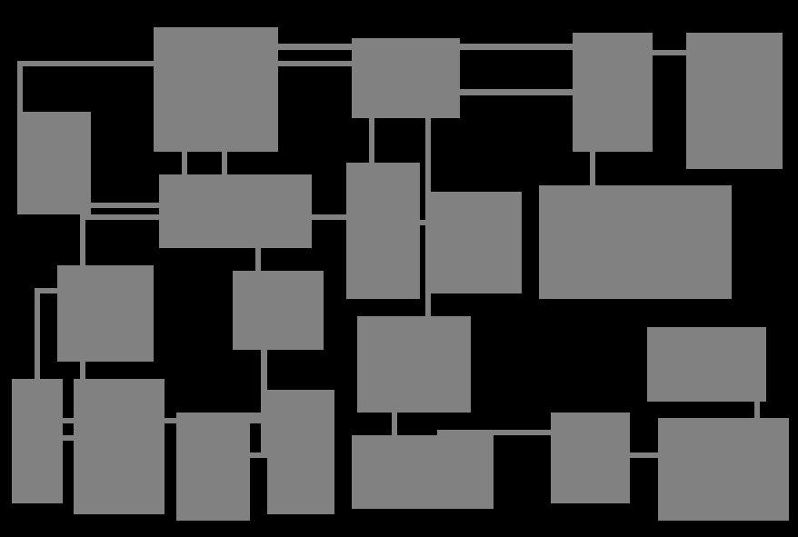

# BSP Dungeon Generation with Unity ECS

Experiment with Unity ECS in implementing binary space partitioning to generate random dungeons.

[Demo](https://nagachiang.github.io/unity-ecs-bsp-dungeon-generation/)

## Dependencies

- Unity 2019.2.0f1
- Entities 0.0.12-preview
- Hybrid Renderer 0.0.1-preview
- Jobs 0.0.7-preview

## References

- [Getting Started with ECS in Unity 2019 by Code Monkey](https://www.youtube.com/watch?v=ILfUuBLfzGI)
- [Basic BSP Dungeon generation - RogueBasin](http://www.roguebasin.com/index.php?title=Basic_BSP_Dungeon_generation)
- [Part 3 - Generating a dungeon | Roguelike Tutorials](http://rogueliketutorials.com/tutorials/tcod/part-3/)
- [Random 2D dungeon generation in Unity using BSP (Binary Space Partitioning) trees](http://www.rombdn.com/blog/2018/01/12/random-dungeon-bsp-unity/)
